## DSpace REST Reporting Tools – A REST Based Application within DSpace 6

Terry Brady

Georgetown University Library

https://github.com/terrywbrady/info

---

### REST Report Tools

- Released as a part of DSpace 6
- Intended for Repository Managers
- As DSpace 6 adoption increases, it is a good time to consider these tools
- Built on the legacy DSpace 6 REST API

+++

### Purpose
- Metadata-centric view of your repository
- Check for consistency
- Generate metadata update files to repair inconsistencies
- Answer questions
- Locate feature use cases

+++

### Try it yourself

- [Tutorial Pages](https://terrywbrady.github.io/restReportTutorial/intro)
- You can even perform this on demo.dspace.org
- Note: there are some bugs fixes that will be included in DSpace 6.3 (Jun 2018)
  - The tutorial will mention which steps depend on these fixes

---
### Setup/Test Data

The test files referenced in this presentation are available on github.

See the tutorial for instructions.

---
### Create Tutorial Community

- Login as Administrator
- Create a community for the tutorial

+++

+++

+++

---
### Test Data
This test will use the following file to create 14 items with unique metadata.
[metadataUpload.csv](https://github.com/terrywbrady/restReportTutorial/blob/master/demo1/metadataUpload.csv)
+++
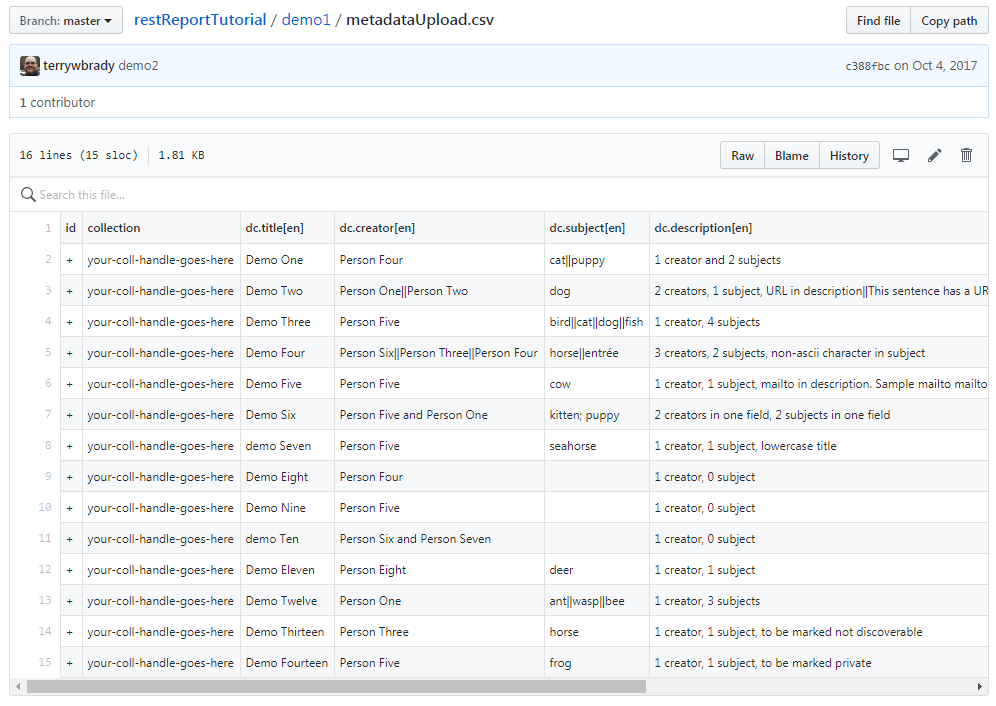
+++

### Create a Collection named Demo 1
+++

+++
#### Navigate to the Collection and Get Its Handle

+++
Edit metadataUpload.csv, replace "your-coll-handle-goes-here"
+++

+++
Bulk Import metadataUpload.csv
+++

+++
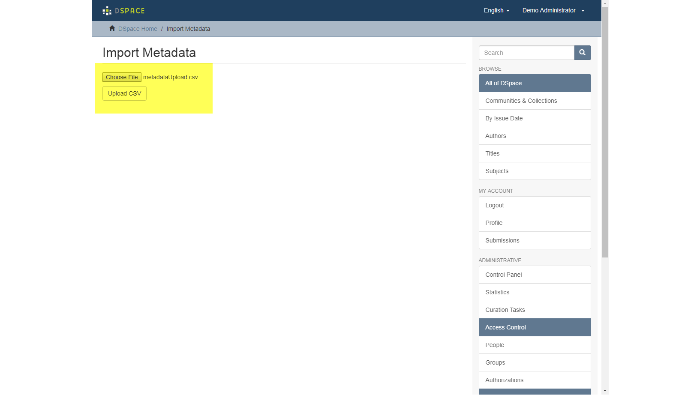

+++
#### Review the report and select "Apply Changes"

+++
### Demo 1 Queries
+++
Open the REST Report Query Tool:
- /rest/static/reports/query.html
+++
#### Select your "Demo 1" collection from the collection list
+++

+++
#### Run the pre-defined query "Has compound subject"
- Include dc.subject in the report output
+++

+++
- Export the results and fix the metadata with a bulk update
  - Change __kitten; puppy__
  - to __kitten||puppy__

+++

+++
#### Run the pre-defined query "Has compound dc.creator"
- Include dc.creator in the report output
+++

+++
- Export the results and fix the metadata with a bulk update
  - Change __Person Five and Person One__
    - to __Person Five||Person One__
  - Change __Person Six and Person Seven__
    - to __Person Six||Person Seven__
+++

+++
#### Run the pre-defined query "Has URL in dc.description"
- Include dc.description in the report output
+++

+++
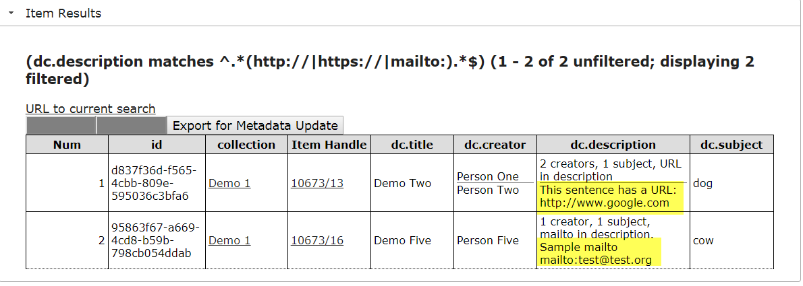
+++
#### Run the pre-defined query "Has non-ascii character in metadata"
- Include dc.subject in the report output
+++

+++

+++
#### Select "New Query" to return all items
+++

+++
- Export all results as a CSV
- Fix the lowercase titles in the export file
- Bulk update the file
+++

---
### Demo 2: Item Special Cases - Exploring Filters
+++
Query for items containing "TODO" in dc.description.abstract
+++

+++

+++
In DSpace, edit the item "TODO: withdraw" and Withdraw it
+++
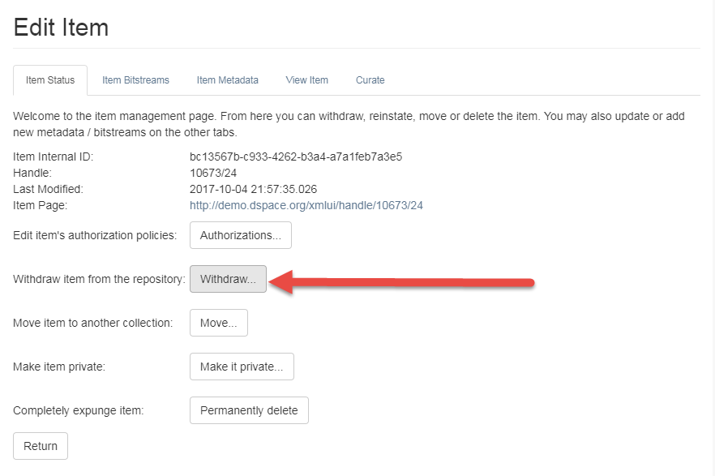
+++
In DSpace, edit the item "TODO: make private" and Make it private
+++
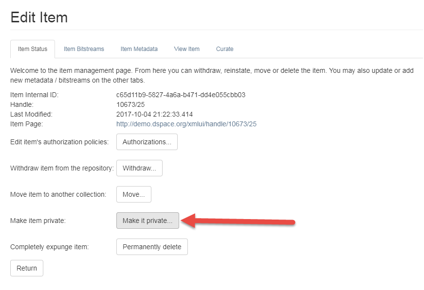
+++
Rerun the query tool, note that the withdrawn item does not appear

Items that a user cannot access will be filtered from the result set (unless you override this behavior in code)
+++
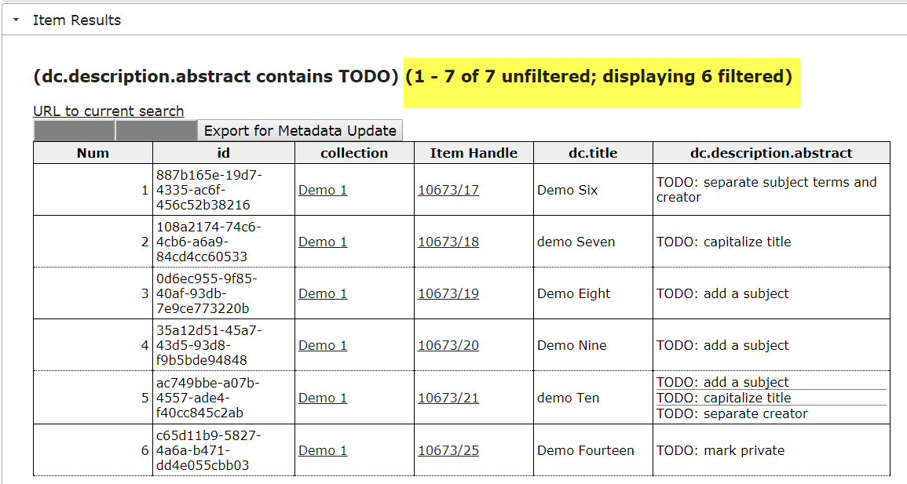
Login to the REST interface to include withdrawn items in the report
+++
- In a new tab, open /rest/static/reports/authenticate.html
- Sign in as an administrator
+++
RE-run the TODO query
+++

+++
## Collection Report - Special Filters

Open the "Collection Filter" Report: /rest/static/reports/index.html
+++
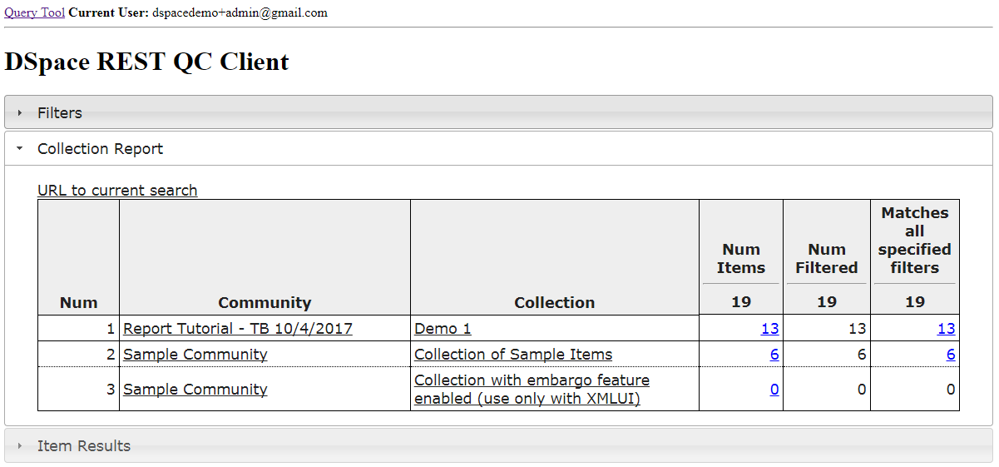
+++
Set Filters to View Counts of Private and Discoverable Items
+++
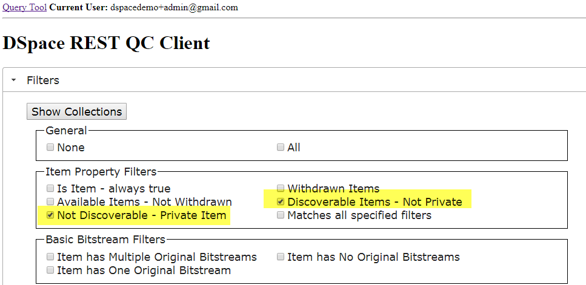
+++
View Filter Counts
+++
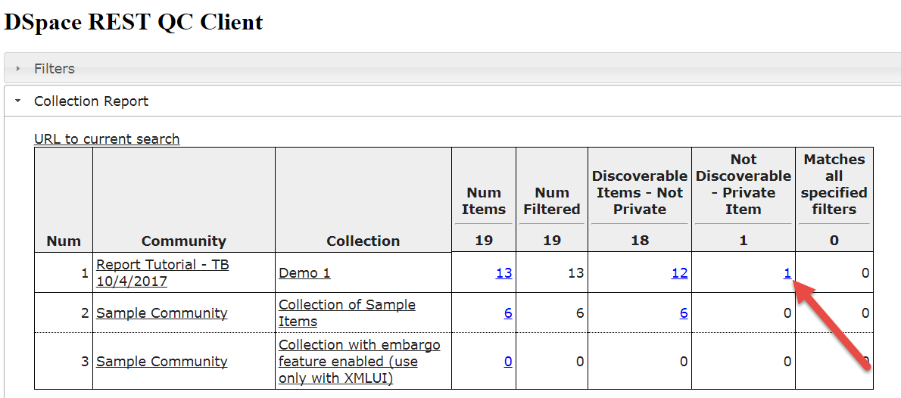
+++

+++
Add dc.description.abstract to Item Listing
+++
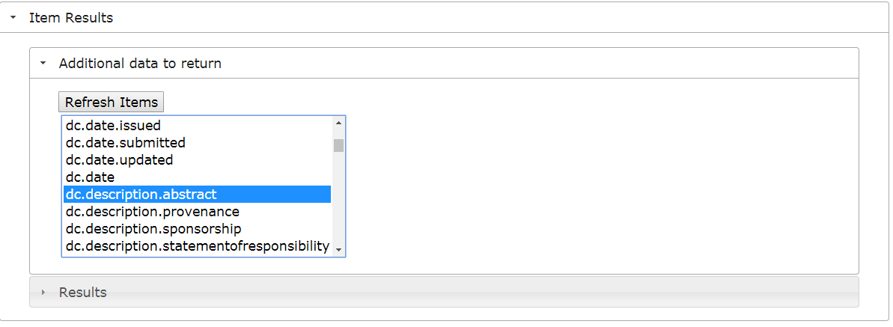
+++
View Item Listing with dc.description.abstract
+++
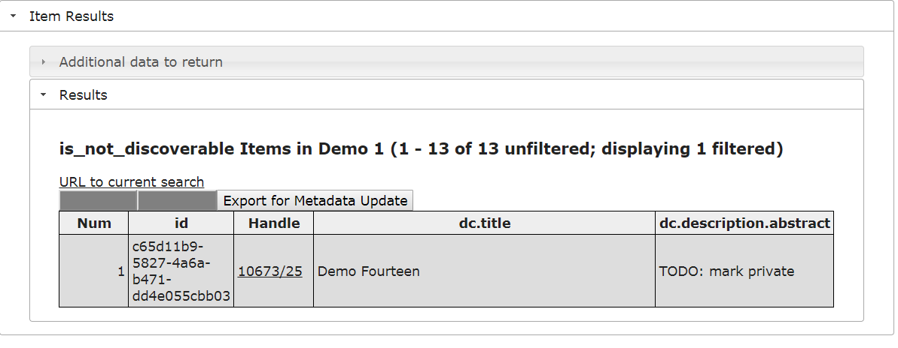
---
## Bitstream Filters

Ingest Items with Zero, One, and Two Items and apply Bitstream Filters

The file [itemsWithBitstreams.zip](https://github.com/terrywbrady/restReportTutorial/tree/master/demo3/data) will be used to populate a collection used in this demonstration.

+++
In your test community, create a new Collection Named "Demo 3".  Ingest the __itemsWithBitstreams.zip__.
+++

+++
### Query for Items based on Bitstream Filters
+++
Open the Collection Report

+++
Set the Filter based on Original Bitstream Count
This report can be used to ensure consistent bitstream content within a collection.
+++
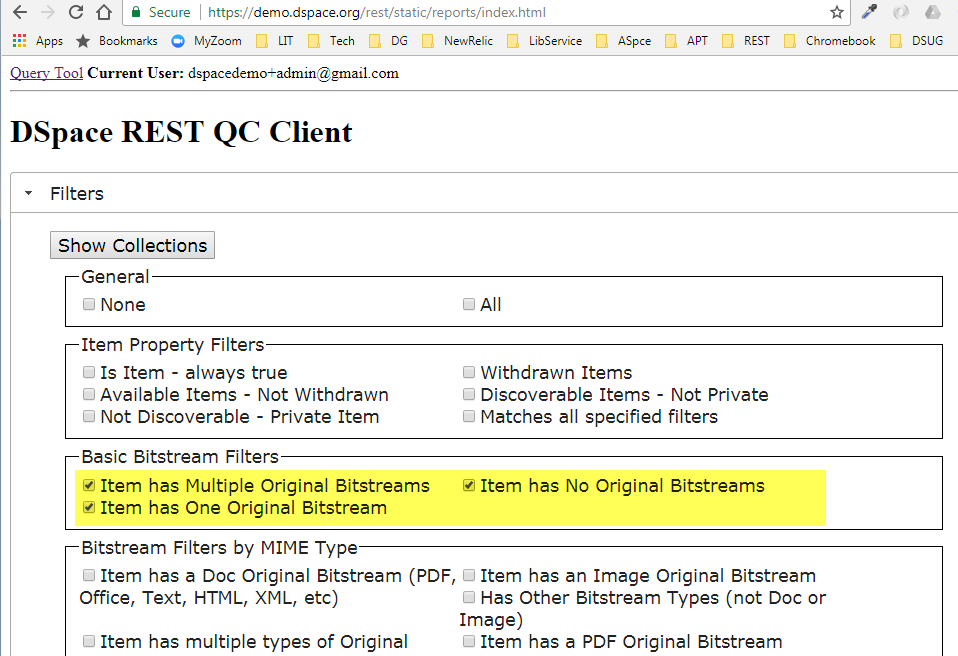
+++

+++
Set the Filter based on Original Bitstream Type (Document or Image)

- This report can be used to ensure consistent bitstream content within a collection.
- If this filter is paired with the metadata query tool, it can be used to enforce required metadata for a specific bitstream type.
+++

+++

