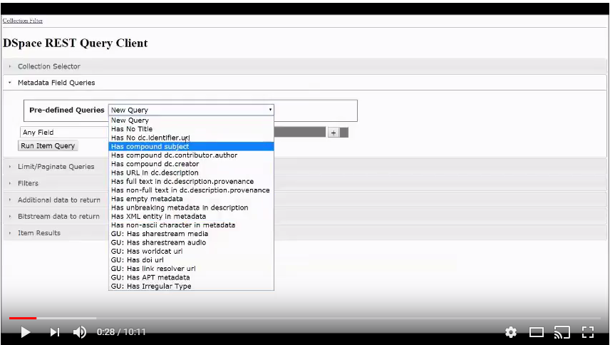

# Tutorial for the DSpace REST Report Tools



The DSpace 6.0 release contained a set of reporting tools built upon the DSpace REST API.  See https://wiki.duraspace.org/display/DSPACE/DSpace+Release+6.0+Status

## Purpose of the DSpace REST Report Tools
These report tools allow a repository manager to enforce metadata standards and bitstream policies across their collections.

## Introduction
This video provides an overview of the DSpace REST Report Tools.

The DSpace instance shown in this video contains some bug fixes that will be included in DSpace 6.3 release.
## Try it yourself
- [Setup The Tutorial](setup/README.md)
- [Demo 1: Metadata Load and Update](demo1/README.md)
  - This demo will be run on demo.dspace.org.
- [Demo 2: Item Special Cases - Exploring Filters](demo2/README.md) 
  - This demo will be run on demo.dspace.org.
- [Demo 3: Ingest Items with Zero, One, and Two Items (PDF and Docs)](demo3/README.md)
  - This demo will be run on demo.dspace.org.
- [Demo 4: Ingest Items with Embargo](demo4/README.md)
  - This demo will be run on demo.dspace.org.
- [Demo 5: View Bitstream Properties](demo5/README.md)
  - This demo needs the code that will be included in DSpace 6.3.
- [Demo 6: Highlight Custom Extensions to the the REST Query Tools](demo6/README.md) 
  - This demo will feature custom extensions to the DSpace REST Report Tools.
  

